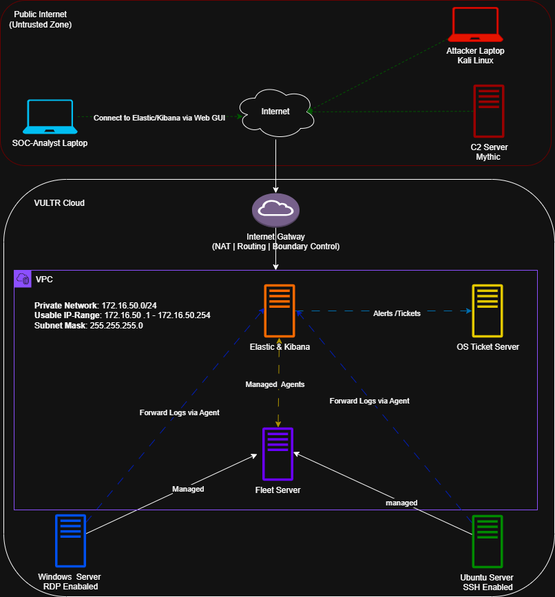

# Elastic SIEM — Multi-Stage Attack Investigation

End-to-end SOC investigation of real and simulated attacks using the Elastic Stack across a cloud-based lab environment.

---

## Project Overview

I built and operated a cloud-based SOC using the Elastic Stack, ingesting over **5.8 million security events** from Windows and Linux systems, capturing real-world brute-force activity while simulating adversary behavior using Mythic C2.

The investigation covered multiple attack scenarios, including SSH and RDP brute-force attempts and a full compromise chain involving PowerShell payload delivery, masqueraded binary execution, persistent C2 communication, and data exfiltration. Indicators were validated using OSINT (VirusTotal, AbuseIPDB) and mapped to MITRE ATT&CK.

---

## Key Findings

- **222,601 brute-force attempts** from 368 external IP addresses  
- **143,707 SSH failures** and **78,894 RDP failures** detected  
- Successful compromise achieved via weak RDP credentials  
- PowerShell used to download payload from attacker's infrastructure  
- Malicious binary (`svchost-aksec.exe`) executed and persisted  
- Persistent Mythic C2 communication established  
- Data exfiltration completed over the C2 channel  
- Full compromise achieved in approximately **25 minutes**  

---

## Architecture

Cloud-based SOC environment integrating SIEM, endpoint telemetry, network monitoring, adversary simulation, and ticketing to enable centralized logging, detection, and incident investigation across Windows and Linux systems.

---

## Tools & Technologies

| Category | Tools |
|---------|--------|
| Cloud & Infrastructure |    |
| SIEM & Endpoint Telemetry |     |
| Endpoint & Agent Management |   |
| Network & IDS |   |
| Adversary Simulation & Attack Tools |     |
| Detection Engineering |   |
| Incident Response & EDR |    |
| Threat Intelligence |    |
| Visualization & Documentation |  |
| Frameworks |  |

---

## Investigation Highlights

- Ingested and analyzed **5.8M+ events** across Windows and Linux endpoints  
- Detected large-scale brute-force activity targeting exposed services  
- Identified successful RDP compromise and tracked post-authentication behavior  
- Correlated authentication, process, and network telemetry to confirm attacker activity  
- Traced payload delivery via PowerShell and execution of a masqueraded binary  
- Confirmed persistent C2 communication associated with Mythic Apollo agent  
- Extracted and validated IOCs (IP addresses, hashes, process artifacts)  
- Reconstructed full attack timeline from initial access to data exfiltration  

---

## Attack Flow

**RDP Brute Force → Successful Login → PowerShell Payload → Execution → C2 → Data Exfiltration**

---

## Detection Logic

| Detection | Data Source | Description |
|----------|------------|-------------|
| SSH Brute Force | Linux Auth Logs | High-volume failed login attempts across multiple users |
| RDP Brute Force | Windows Event Logs (4625) | Repeated failed RDP logons followed by successful authentication |
| Successful RDP Logon | Event ID 4624 (Type 10) | Remote interactive logon indicating compromise |
| Privileged Logon | Event ID 4672 | Elevated privileges assigned after authentication |
| Suspicious PowerShell Execution | Sysmon Event ID 1 | Payload download and execution activity |
| Masquerading Binary Execution | Sysmon Event ID 1 | `svchost-aksec.exe` executed from non-standard directory |
| C2 Communication | Network Logs / Elastic | Persistent outbound communication to attacker infrastructure |

---

## Investigation Evidence

### 1. Initial Access — RDP Brute Force
*(Insert Kibana dashboard showing failed logons)*

### 2. Successful Authentication — Administrator Login
*(Insert Event ID 4624 evidence)*

### 3. Defense Evasion — Defender Disabled
*(Insert Event ID 5001 evidence)*

### 4. Payload Delivery — PowerShell Execution
*(Insert PowerShell command evidence)*

### 5. Payload Execution — Masqueraded Binary
*(Insert svchost-aksec.exe process evidence)*

### 6. Command & Control (C2)
*(Insert outbound connection evidence)*

### 7. Data Exfiltration
*(Insert exfiltration evidence)*

---

## Lessons Learned

- High-volume brute-force activity requires threshold-based detection and tuning  
- Weak credentials remain a primary entry point for attackers  
- Correlating authentication and process telemetry is critical for confirming compromise  
- PowerShell is widely abused for payload delivery and execution  
- Masquerading binaries can evade basic detection mechanisms  
- Persistent outbound connections to external infrastructure indicated active C2 communication 
- Detection engineering improves visibility across multi-stage attacks  
- Structured investigation workflows improve consistency and accuracy  

---

## Artifacts

- [**30-Day Elastic SOC Final Report (PDF)**](REPLACE_WITH_YOUR_LINK) — Full investigation, detection engineering, and attack analysis  
- [**C2 Investigation Methodology**](REPLACE_WITH_YOUR_LINK) — Structured investigation workflow  
- [**RDP Brute Force Investigation Report**](REPLACE_WITH_YOUR_LINK) — Authentication attack case study  

---

## License

© 2026 Abdul Kuyateh. All rights reserved.

This project is for educational and portfolio purposes only. Unauthorized use, reproduction, or distribution is prohibited.

---

*All activity performed in a controlled lab environment with intentionally exposed services to simulate real-world attack traffic.*
